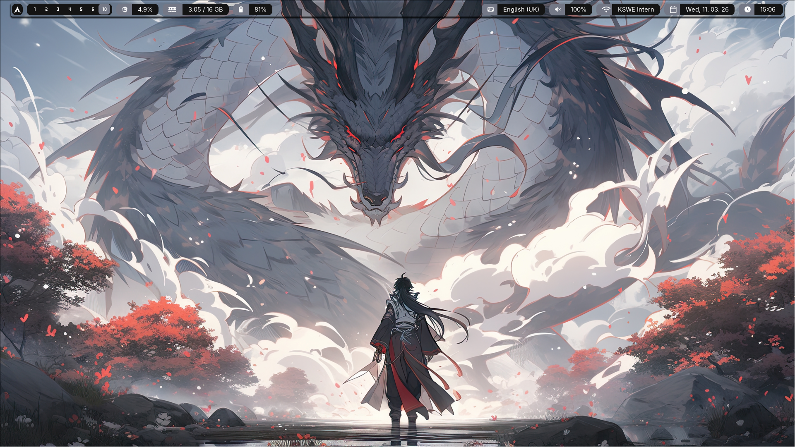
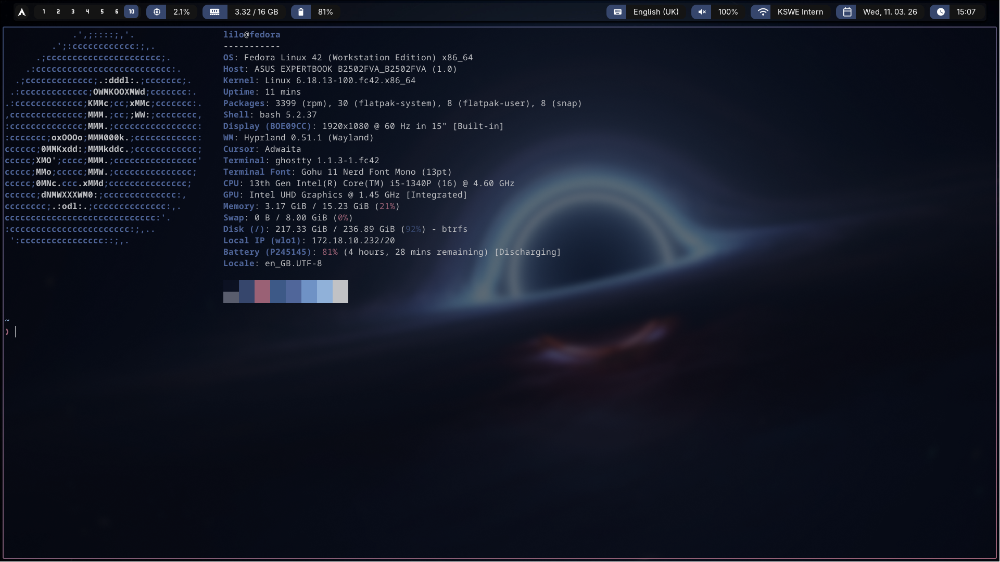
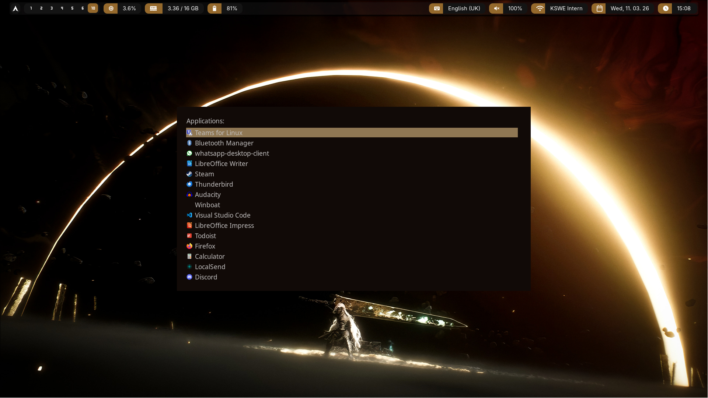

# Lilos Hyprland Setup
## Screenshots
### A sample Background with bar written in eww on Top

### Another Background with the default Terminal

### Another Background with the rofi running in drun mode

## Note
I am currently working on a new setup using wleave for the logout screen and using Quickshell for some implementations (mainly the bar for now).
